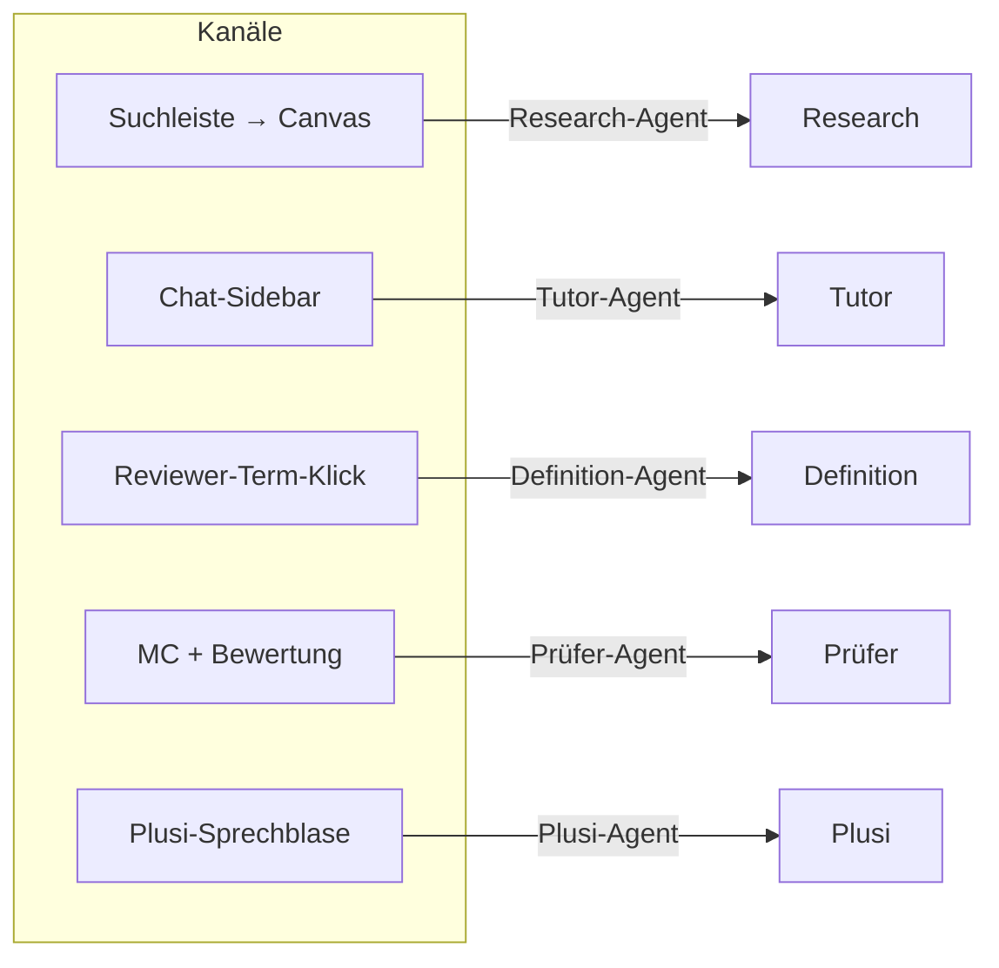
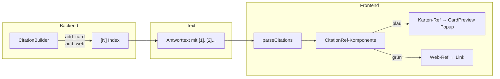
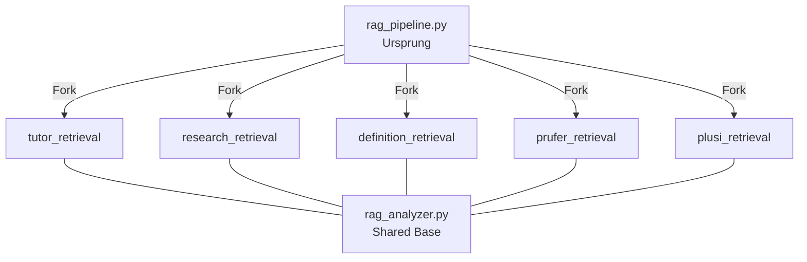
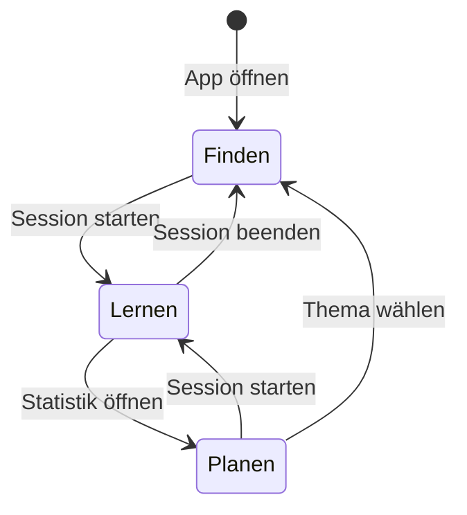

# Agent-System — Übersicht

> Lesezeit: ~5 Minuten. Klicke links auf einen Agenten für Details zu seiner Pipeline, Tools und Benchmarks.

---

## 1. Agent-Kanal-Paradigma

In AnkiPlus gibt es **keinen Router, der einen Agenten auswählt**. Stattdessen bestimmt der Kanal (UI-Bereich) den Agenten vollständig. Wer einen Kanal öffnet, spricht automatisch mit dem dort verankerten Agenten — kein `@mention`, kein Wechsel mid-session.



**Konsequenz:** Jeder Agent ist vollständig isoliert — eigener Gesprächsspeicher, eigene RAG-Pipeline, eigener System-Prompt. Es gibt keine globale Session, die zwischen Agenten geteilt wird.

---

## 2. Agent-Übersicht

| Agent | Kanal | Modus | RAG | Citations | Status |
|-------|-------|-------|-----|-----------|--------|
| **Tutor** | session (Chat-Sidebar) | Verlaufsbasiert, kartengebunden | Eigene Pipeline (`tutor_retrieval`) | Karte + Web | Produktiv |
| **Research** | stapel (Suchleiste → Canvas) | State-basiert | Eigene Pipeline (`research_retrieval`) | Karte + Web | Produktiv |
| **Definition** | reviewer-term (Klick auf Term) | Popup, KG-basiert | Eigene Pipeline (`definition_retrieval`) | Karte | Produktiv |
| **Prüfer** | reviewer-inline (MC + Bewertung) | Inline-Bewertung | Eigene Pipeline (`prufer_retrieval`) | Karte (in Erklärungen) | Wired |
| **Plusi** | plusi (Sprechblase) | Persönlichkeit + App-Hilfe | Eigene Pipeline (`plusi_retrieval`) | Optional | Wired |

---

## 3. Gemeinsame Architektur

Alle Agenten teilen dieselbe Grundstruktur — unterschiedliche Persönlichkeit, gleiche Mechanik.

### 3.1 Standard-Interface

Jeder Agent implementiert:

```python
async def run_agent(
    situation: dict,
    emit_step: Callable,
    memory: AgentMemory,
    stream_callback: Callable,
    citation_builder: CitationBuilder,
    **kwargs
) -> None
```

| Parameter | Bedeutung |
|-----------|-----------|
| `situation` | Kontext des Aufrufs (Karte, Anfrage, Deck etc.) |
| `emit_step` | Sendet Pipeline-Events an das Frontend |
| `memory` | Isolierter Gesprächsspeicher des Agenten |
| `stream_callback` | Streamt Text-Chunks zum Frontend |
| `citation_builder` | Einheitliche Citation-Erzeugung (`[N]`-Indices) |

### 3.2 Dispatch

Alle Agenten werden über `handler._dispatch_agent()` aufgerufen. Der Dispatcher:

1. Liest den `agent`-Typ aus der eingehenden Nachricht
2. Instanziiert `CitationBuilder` und `AgentMemory`
3. Ruft `run_agent()` der zuständigen Agent-Klasse auf
4. Leitet Pipeline-Events an das Frontend weiter

### 3.3 Pipeline-Events

```
msg_start → agent_cell → text_chunk* → msg_done
```

| Event | Payload | Bedeutung |
|-------|---------|-----------|
| `msg_start` | `{ agent, messageId }` | Neue Antwort beginnt |
| `agent_cell` | `{ type, content }` | ThoughtStream-Zelle (Reasoning, Tool-Call) |
| `text_chunk` | `{ delta }` | Streaming-Textfragment |
| `msg_done` | `{ citations[] }` | Antwort abgeschlossen, Citations übergeben |

---

## 4. Citation-System

Das Citation-System ist vollständig einheitlich — vom Backend bis zum Render.



**Regeln:**

- Backend: `CitationBuilder.add_card()` / `add_web()` — gibt `[N]` zurück, Agent schreibt den Index direkt in den Text
- Kein anderes Format (`(Quelle:...)`, `[source]`, etc.) ist erlaubt
- Frontend: `parseCitations` zerlegt den Text, `CitationRef` rendert Badges
- Blau = Karten-Referenz, öffnet CardPreview-Popup bei Klick
- Grün = Web-Referenz, öffnet URL

**Implementierung:** `ai/citation_builder.py` — `CitationBuilder`-Klasse

---

## 5. RAG-Pipeline-Architektur

Jeder Agent hat seine **eigene, unabhängige RAG-Pipeline**.

```
ai/retrieval_agents/
├── tutor_retrieval.py
├── research_retrieval.py
├── definition_retrieval.py
├── prufer_retrieval.py
└── plusi_retrieval.py
```

**Shared Base:** `ai/rag_analyzer.py` — Router/Intent-Analyse (wird von allen Pipelines genutzt, liefert `search_needed`, `resolved_intent`, `retrieval_mode`, `search_scope`).

**Stand 2026-04-01:** Alle Pipelines sind Forks von `rag_pipeline.py` und aktuell noch identisch. Sie divergieren ab jetzt unabhängig voneinander je nach Agent-Anforderungen (z.B. Tutor: erklärungsorientiert, Research: web-first, Definition: KG-basiert).



**Warum Forks statt Vererbung?** Jede Pipeline soll sich unabhängig entwickeln können — unterschiedliche Retrieval-Strategien, Schwellwerte, Ranking-Logik — ohne Regressions-Risiko für andere Agenten.

---

## 6. Drei kognitive Modi

Die Anwendung ist in drei kognitive Modi unterteilt, die unterschiedliche Lernphasen abbilden:

| Modus | Tab | Primärer Agent | Funktion |
|-------|-----|---------------|----------|
| **Finden** | Stapel | Research | Themen erkunden, Karten durchsuchen, Zusammenhänge verstehen |
| **Lernen** | Session | Tutor | Karten wiederholen, erklären lassen, Wissenslücken schließen |
| **Planen** | Statistik | — | Lernfortschritt auswerten, nächste Schritte ableiten |



---

## Weiterführend

| Thema | Dokument |
|-------|----------|
| Produkt-Gesamtkonzept | `docs/vision/product-concept.md` |
| Architektur (technisch) | `docs/reference/RETRIEVAL_SYSTEM.md` |
| Design-System | `docs/reference/DESIGN.md` |
| Global Shortcut Filter | `docs/superpowers/specs/2026-03-20-global-shortcut-filter.md` |
| Unified Design System Spec | `docs/superpowers/specs/2026-03-20-unified-design-system.md` |

> **Navigation:** Klicke links auf einen Agenten für Details zu seiner Pipeline, Tools und Benchmarks.
