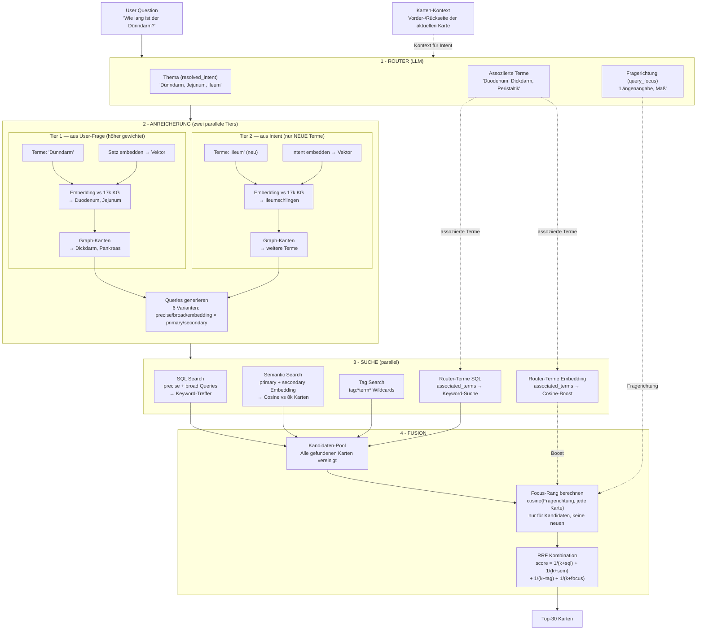

# Tutor Agent

## Übersicht

| Eigenschaft | Wert |
|-------------|------|
| **Name** | Tutor |
| **Kanal** | `session` (Chat-Sidebar im Reviewer) |
| **Modus** | Verlaufsbasiert, kartengebunden |
| **RAG** | Eigene Pipeline (`ai/retrieval_agents/tutor_retrieval.py`) |
| **Citations** | Card + Web (via CitationBuilder) |
| **Status** | Produktiv |
| **Entry Point** | `ai/tutor.py:run_tutor()` |

Der Tutor ist der Hauptagent von AnkiPlus. Er beantwortet Fragen im Kontext der aktuellen Karte, nutzt das RAG-System um relevante Karten zu finden, und generiert strukturierte Antworten mit Quellen-Transparenz.

## Kanal & UI

Der Tutor lebt in der **Session-Ansicht** — dem Chat-Seitenpanel während der Kartenrepetition. Der Verlauf ist kartengebunden: Nachrichten gehören zur aktuellen Karte und werden pro Karte gespeichert/geladen.

**Interaktion:** Nutzer tippt Frage in ChatInput → Tutor sucht relevante Karten → generiert Antwort mit [1], [2] Referenzen → Nutzer kann Referenzen anklicken.

## Retrieval-Pipeline

Die Tutor-Pipeline hat drei Phasen:

1. **Router** — LLM entscheidet: welcher Agent, ob Suche nötig, resolved_intent, associated_terms
2. **Retrieval** — Findet relevante Karten via SQL + Semantic + KG + RRF (liefert Top-30)
3. **Generation** — Tutor baut strukturierte Antwort mit Quellen-Transparenz und Safety-Checks

**Datei:** `ai/retrieval_agents/tutor_retrieval.py` (geforkt aus `ai/rag_pipeline.py`, 2026-04-01)

### Pipeline-Diagramm



### 5 Phasen im Detail

```
USER QUESTION: "wie lang ist der dünndarm"
    |
    v
PHASE 1: ROUTER (~250ms, backend LLM)
    Agent routing + context resolution
    Output: {
      agent: "tutor",
      search_needed: true,
      resolved_intent: "Dünndarm, Jejunum, Ileum, Duodenum",
      associated_terms: ["Duodenum", "Dickdarm", "Peristaltik"]
    }
    |
    v
PHASE 2: TERM EXTRACTION + EMBEDDING (~200ms, 1 API call)
    Extract terms: ["Dünndarm"]
    Batch embed: [terms, query, resolved_intent]
    -> term vectors, sentence vector, intent vector
    |
    v
PHASE 3: KG ENRICHMENT (~30ms, local)
    A. Sentence-level expansion: sentence vector vs 17k KG term embeddings
       -> Duodenum(0.67), Jejunum(0.66), Ileumschlingen(0.69)
    B. KG-based stopword filter: "macht", "liegt" NOT in KG -> excluded
    C. Edge expansion: Dünndarm -> Dickdarm(7), Pankreas(6)
    D. Query generation (deterministic, no LLM)
    |
    v
PHASE 4: PARALLEL SEARCH (5 lanes)
    Lane 1-2: SQL Search (precise + broad from KG enrichment)
    Lane 3:   Semantic Search (primary + secondary embedding)
    Lane 4:   Associated Terms (Router's LLM terms as own SQL lane)
    Lane 5:   Feedback SQL (KG terms from top semantic hits)
    |
    v
PHASE 5: RRF FUSION + CONFIDENCE
    score(card) = Σ 1/(k + rank_i) for each lane
    Confidence: HIGH (≥0.025) → cards, LOW (<0.012) → web search
```

### Alle Queries im Überblick

**SQL-Suche (Keyword-basiert, via Anki `find_cards()`)**

| # | Query | Quelle | Logik | RRF k-Wert |
|---|-------|--------|-------|------------|
| 1 | Precise Primary | Tier 1 (Frage) | AND | k=50 (stärkste) |
| 2 | Broad Primary | Tier 1 (Frage) | OR | k=70 |
| 3 | Precise Secondary | Tier 2 (Intent) | AND | k=90 |
| 4 | Broad Secondary | Tier 2 (Intent) | OR | k=110 |
| 5 | Tag Search | Tier 1 + 2 | Wildcard | k=70 |

**Embedding-Suche (Cosine Similarity vs 8k Karten)**

| # | Query | Quelle | RRF k-Wert |
|---|-------|--------|------------|
| 6 | Semantic Primary | Tier 1 (Frage) | k=60 |
| 7 | Semantic Secondary | Tier 2 (Intent) | k=120 (schwächste) |

**Router-generierte Terme + Focus**

| # | Signal | Quelle | RRF k-Wert |
|---|--------|--------|------------|
| 8 | Router SQL | associated_terms | k=65 |
| 9 | Router Embedding | associated_terms | k=65 |
| 10 | Focus Rang | Original-Frage | k=80 |

**Gewichtungs-Hierarchie** (niedrigerer k = stärkerer Einfluss):

```
k=50  Precise Primary     ████████████████████  stärkste
k=60  Semantic Primary    ██████████████████
k=65  Router SQL/Embed    █████████████████
k=70  Broad/Tag Primary   ████████████████
k=80  Focus Rerank        ██████████████
k=90  Precise Secondary   ████████████
k=110 Broad Secondary     ██████████
k=120 Semantic Secondary  █████████             schwächste
```

### Zwei Quellen der Anreicherung

| | Backend Router (LLM) | KG Enrichment (local) |
|---|---|---|
| **Kosten** | API tokens | Kostenlos |
| **Latenz** | ~250ms | ~30ms |
| **Stärke** | Versteht Intent, paraphrasiert | Findet exaktes Vokabular in DEINEN Karten |
| **Schwäche** | Kennt deinen Karteninhalt nicht | Versteht Intent nicht |

Der Router bringt **Weltwissen**. Der KG bringt **Sammlungs-Wissen**. Zusammen decken sie "was sollte existieren" und "was existiert tatsächlich in deinem Deck" ab.

## Generation — Antwort-Architektur

### Response-Struktur

```
┌─────────────────────────────────────────────────┐
│ 1. SAFETY CHECK (nur wenn nötig)                │
│    Widerspruch / Fehler / Unsicherheit          │
├─────────────────────────────────────────────────┤
│ 2. KOMPAKTE ANTWORT                             │
│    1-2 Sätze, Kernaussage + Quelle [1]          │
├─────────────────────────────────────────────────┤
│ 3. ERKLÄRUNG                                    │
│    Ausführlich, mit Quellen [1][2][3]            │
├─────────────────────────────────────────────────┤
│ 4. ZUSAMMENFASSUNG / MERKE                      │
│    Takeaway, das hängenbleibt                   │
└─────────────────────────────────────────────────┘
```

### Wissenshierarchie

| Priorität | Quelle | Verhalten |
|-----------|--------|-----------|
| 1. Höchste | **Anki-Karten** | Primärquelle. Nutze Terminologie und Fakten aus den Karten. |
| 2. Ergänzend | **Tutor-Weltwissen** | Verbindet, erklärt, kontextualisiert. Widerspricht NIE den Karten. |
| 3. Ausnahme | **Web-Suche** | Nur wenn Karten + Weltwissen nicht reichen. |

### Safety Checks

| Check | Trigger |
|-------|---------|
| Impliziter Fehler | User-Frage enthält falsche Annahme |
| Quellen-Widerspruch | Zwei Karten widersprechen sich |
| Verwechslungsgefahr | Ähnliche Begriffe verwechselt |
| Keine Quelle | Karten decken Frage nicht ab |
| Veraltete Info | Karte enthält überholten Stand |

### Generation Fallback

3-Level Fallback-Kette:

1. **Level 1:** Primärmodell mit vollem RAG-Kontext (30 Karten) + Chat-History
2. **Level 2:** Fallback-Modell mit Top-3 Karten, ohne History
3. **Level 3:** Fallback-Modell ohne RAG

## Tools

| Tool | Beschreibung | Display |
|------|-------------|---------|
| `search_deck` | Kartensuche im Deck | Widget (Kartenliste) |
| `show_card` | Einzelne Karte anzeigen | Widget |
| `show_card_media` | Medien einer Karte | Widget (Bilder) |
| `search_image` | Bild-Suche (Molekül/Anatomie) | Widget |
| `create_mermaid_diagram` | Diagramm generieren | Markdown |
| `get_learning_stats` | Lernstatistiken | Widget |

## Benchmark-Ergebnisse

### Aktuelle Ergebnisse (2026-03-29, v81%)

| Metrik | Wert | Anmerkung |
|--------|------|-----------|
| **Recall@30** | **81%** | Target-Karte in Top-30 |
| **Context** | **100%** | card_context terms + embedding fallback |
| **Cross-Deck** | **100%** | War 66% → gelöst durch breiteres Retrieval-Window |
| Direct | 88% | War 75% |
| Typo | 88% | War 75% |
| Synonym | 38% | War 6% → Router associated_terms + breiteres Window |
| Top-3 | 36% | Target-Karte in Top-3 |
| MRR | 0.304 | Mean Reciprocal Rank |

### Verbesserungs-Verlauf

**Session 2026-03-29:** 63% → 81% Recall@30

1. **Retrieval-Window von 10 → 30** — Haupttreiber. Karten wurden gefunden aber auf Rang 11-30, jetzt inkludiert.
2. **Router associated_terms als eigene RRF-Lane** — vorher an SQL-Ergebnisse angehängt (Rang 51+, effektiv ignoriert). Jetzt eigene Lane mit k=65.
3. **LLM semantic Lane verstärkt** — k=75 → k=65.

**Session 2026-03-28:** 46% → 63% Recall@10

1. `resolved_intent` aus card_context.terms für Kontext-Fälle (+9%)
2. Embedding fallback: Query + Intent kombinieren wenn keine Domain-Terme gefunden (+5%)
3. Focus lane: Query-Rerank im Kandidaten-Pool (k=80) (+1%)
4. Router `associated_terms`: LLM-generierte Domain-Terme als SQL + Semantic Lane (+2%)

### Interaktives Dashboard

```bash
python3 scripts/benchmark_serve.py
# Öffne http://localhost:8080 → Tutor-Tab
```

Das Dashboard zeigt:
- Recall@K und Top-3 Metriken
- Per-Step Scores (Term Extraction, KG Expansion, SQL, Semantic, RRF, Confidence)
- Per-Kategorie Breakdown (Direct, Synonym, Context, Cross-Deck, Typo)
- Aufklappbare Pipeline-Traces pro Test-Case
- Re-Run und Regenerate Buttons

### Generation Benchmark

Der Generation-Benchmark evaluiert die Qualität der Tutor-Antworten per LLM-Bewertung:

| Metrik | Beschreibung |
|--------|-------------|
| Struktur-Compliance | Folgt die Antwort der 4-Block-Architektur? |
| Safety-Detection | Erkennt der Tutor implizite Fehler? |
| Kompaktheit | Kompakte Antwort ≤2 Sätze? |
| Fakten-Korrektheit | Stimmen Aussagen mit Quellen überein? |
| Quellen-Nutzung | Korrekt zitiert? Keine erfundenen Quellen? |
| Keine Halluzination | Keine erfundenen Fakten? |

## Key Files

| Datei | Verantwortung |
|-------|---------------|
| `ai/tutor.py` | Agent Entry Point, Generation-Orchestrierung, 3-Level Fallback |
| `ai/retrieval_agents/tutor_retrieval.py` | Tutor-spezifische RAG-Pipeline |
| `ai/retrieval.py` | EnrichedRetrieval — orchestriert die volle Pipeline |
| `ai/rrf.py` | Reciprocal Rank Fusion, Confidence Check |
| `ai/rag.py` | SQL Search (Anki find_cards Wrapper) |
| `ai/kg_enrichment.py` | Term-Extraktion, KG-Expansion, Query-Generierung |
| `ai/embeddings.py` | Embedding API, Card Index, KG Term Index |
| `ai/rag_analyzer.py` | Router-Auswertung (RagAnalysis) |
| `storage/kg_store.py` | KG Persistence (17k Terme, Kanten, Definitionen) |
| `ai/agent_loop.py` | Multi-Turn Agent Loop (Tool-Calls, Streaming) |
| `ai/system_prompt.py` | System-Prompt-Konstruktion |

## KG Enrichment Strategie

### Universal Stopword Filter

Kein hardcodiertes Stopword-Wörterbuch. Stattdessen:

```
Term in KG? → Domain-Term → nutze für SQL + Embedding
Term NOT in KG? → Generisches Wort → nutze nur für Embedding
```

### Term Expansion

```
1. Sentence embedding vs KG term embeddings → semantische Synonyme
2. Edge expansion auf ALLE gefundenen Terme → Ko-Okkurrenz-Terme
3. Morphologischer Varianten-Filter entfernt Rauschen
```

### Multi-Word Term Detection

Lateinische Kompositum-Präfixe (Plexus, Nervus, Arteria) triggern Multi-Wort-Extraktion:
- "Plexus brachialis" → ein Term
- Konsekutive Großbuchstaben-Wörter: "Braunes Fettgewebe" → ein Term

## Bekannte Limitierungen

1. **Synonym-Recall nur 38%** — Router-Terms nur für 32/80 Benchmark-Fälle vorhanden
2. **KG-Term-Embeddings als Einzelwörter** — "Jejunum" als nacktes Wort ist lexikalisch weit von "Dünndarm"
3. **Nur 28 von 17.335 Termen haben Definitionen** — Terme mit Definition werden besser embedded
4. **Tag-basierte Suche noch nicht benchmarked**

## Changelog

### v3.0 (2026-03-29) — 81% Recall@30

- Retrieval-Window von 10 → 30
- Router associated_terms als eigene RRF-Lane (k=65)
- LLM semantic Lane verstärkt (k=75 → k=65)

### v2.1 (2026-03-27)

- Backend Router entkoppelt von Query-Generierung
- Tag-basierte Suche hinzugefügt
- Card Content Cache
- Semantic-informed SQL Expansion (Feedback Loop)

### v2.0 (2026-03-27)

- KG-enriched Query Expansion, RRF Scoring, Embedding-first Expansion

### v1.0 (pre-2026-03-27)

- LLM Router generiert Queries, KG als Dead-Arm Parallel-Suche
