# Tutor Query Pipeline — State Machine

Complete state machine for a single Tutor query: from the user pressing Enter
in React all the way down to the Gemini backend and back up to the UI.

Each state corresponds to a log line of the form
`[STATE <S-id> <phase>] <STATUS> | key=value …` emitted by `ai/rag_pipeline._log_state`.
All states are instrumented — grep a log file for `[STATE ` to see the full trace
of a single request.

## Log format

```
[STATE S9 rag.retrieval] ENTER | embedding_manager=True mode='both' kg_enrichment=True
[STATE S9 rag.retrieval] TRY   | retriever='EnrichedRetrieval'
[STATE S9 rag.retrieval] OK    | retriever='EnrichedRetrieval' citations=15 confidence='medium' keyword_hits=8
[STATE S9 rag.retrieval] EXIT  | citations=15 context_chars=1820 confidence='medium' next='S10 rag.reranker'
```

Statuses in use:
- **ENTER** — a state is about to execute
- **TRY** — attempting a sub-operation (retriever, external call)
- **OK** — sub-operation succeeded with data
- **SKIP** — this state was gated off by config or input
- **BRANCH** — a decision was taken that changes downstream behavior
- **RESULT** — a datum worth seeing in its own line (top-N cards, per-source details)
- **FAIL** — caught exception, falling through
- **EXIT** — state is done, includes the `next=` pointer

## Worked example threaded through the diagram

To make the diagram concrete, every transition label below shows real
data from a single hypothetical request:

> **Setup:** A medical student has a card open titled *"Aphasien —
> Übersicht"* (`card_id=1234`) and types into the chat:
>
> > "Was ist Wernicke-Aphasie?"

The numbers and quoted strings on the diagram's edges (`18 raw`,
`kept 11/15`, `precise=['Wernicke-Aphasie', ...]`, etc.) are what flows
through the pipeline for this exact query on the happy path. Notes
attached to certain states show alternative paths (e.g. what happens
when the reranker over-rejects, or when the question is a meta-reference
like *"Erklär mir die Karte"*).

This is the same "happy path through a typical card-anchored query"
example that the debugging recipes below also use, so you can map
log lines back to the diagram one-to-one.

## Mermaid state diagram

```mermaid
stateDiagram-v2
    [*] --> S0_idle_ui

    S0_idle_ui: S0 react.idle_ui
    S1_queued_js_to_py: S1 bridge.queue_poll
    S2_widget: S2 widget.handle_message
    S3_thread: S3 thread.bootstrap
    S4_handler: S4 handler.entry
    S5_router: S5 rag.analyze_query
    S6_dispatch: S6 handler.dispatch_agent
    S7_tutor: S7 tutor.entry

    S8_parse: S8 rag.parse_routing
    S9_retrieval: S9 rag.retrieval
    S10_reranker: S10 rag.reranker
    S11_web: S11 rag.web_fallback
    S12_inject: S12 rag.inject_current_card
    S13_build: S13 rag.build_result

    S14_citations: S14 tutor.citation_build
    S15_llm: S15 tutor.llm_dispatch
    S16_payload: S16 gemini.build_payload
    S17_loop: S17 agent_loop.iterate
    S18_handoff: S18 tutor.handoff_parse
    S19_return: S19 tutor.return
    S20_dispatch_exit: S20 handler.dispatch_agent EXIT
    S21_signals: S21 thread.finalize
    S22_main_relay: S22 main_thread.relay
    S23_react: S23 react.receive

    S0_idle_ui --> S1_queued_js_to_py: user types "Was ist Wernicke-Aphasie?" + Enter
    S1_queued_js_to_py --> S2_widget: 200 ms QTimer drains JS queue
    S2_widget --> S3_thread: AIRequestThread.start() (card_id=1234)
    S3_thread --> S4_handler: handler.get_response_with_rag()
    S4_handler --> S5_router: agent='tutor', uses_rag=True
    S5_router --> S6_dispatch: RagAnalysis{search_needed=T, intent='Wernicke aphasia', precise=['Wernicke-Aphasie',...]}
    S4_handler --> S6_dispatch: uses_rag=False (Definition / Plusi)
    S6_dispatch --> S7_tutor: run_fn(situation='Was ist Wernicke-Aphasie?')
    S7_tutor --> S8_parse: retrieve_rag_context() (card-context override → search_needed=T)

    S8_parse --> S9_retrieval: query_source='router', precise=[3] broad=[8]
    S8_parse --> S13_build: preloaded_cards (Smart Search path)
    S8_parse --> ReturnEmpty1: search_needed=False
    S8_parse --> ReturnEmpty2: no queries available

    S9_retrieval --> S10_reranker: 18 raw → 15 ranked, confidence='medium'
    S9_retrieval --> ReturnEmpty3: all retrievers failed
    S9_retrieval --> ReturnEmpty4: empty context_string

    S10_reranker --> S11_web: kept 11/15, web_search_recommended=False
    S11_web --> S12_inject: SKIP (indexed=11 ≥ 3)
    S12_inject --> S13_build: SKIP (current card already in results)

    ReturnEmpty1 --> S14_citations: empty RagResult
    ReturnEmpty2 --> S14_citations: empty RagResult
    ReturnEmpty3 --> S14_citations: empty RagResult
    ReturnEmpty4 --> S14_citations: empty RagResult
    S13_build --> S14_citations: RagResult{card_citations=11, web_citations=0}

    S14_citations --> S15_llm: 11 card citations queued
    S14_citations --> InjectCurrentOnly: no rag context but current card
    InjectCurrentOnly --> S15_llm: current-card-only context

    S15_llm --> S16_payload: _generate_with_fallback(model='gemini-2.5-flash')
    S16_payload --> S17_loop: SSE stream starts (LERNMATERIAL: 11 lines)
    S17_loop --> S17_loop: function_call → run tool → re-iterate (max 20)
    S17_loop --> S18_handoff: plain text, no more tool calls
    S17_loop --> S18_handoff: duplicate tool call OR max iterations

    S18_handoff --> S19_return: handoff=None (no agent transfer)
    S19_return --> S20_dispatch_exit: {text: 720 chars, citations: 11, handoff: None}
    S20_dispatch_exit --> S21_signals: msg_done emitted
    S21_signals --> S22_main_relay: Qt finished_signal → main thread
    S22_main_relay --> S23_react: window.ankiReceive(payload)
    S23_react --> S0_idle_ui: React renders bubble with [1]…[11] CitationRefs

    S15_llm --> GenerationFail: all 3 fallback models failed
    GenerationFail --> [*]: error bubble to user

    note right of S5_router
        EXAMPLE — happy path (this query):
          IN  : "Was ist Wernicke-Aphasie?"
          OUT : { search_needed=True,
                  resolved_intent='Wernicke aphasia symptoms',
                  precise_queries=['Wernicke-Aphasie',
                                   'sensorische Aphasie',
                                   'Temporallappen'],
                  associated_terms=[8 more] }

        EDGE — meta-reference (the hard case):
          IN  : "Erklär mir die Karte"
          OUT : may return precise_queries=[]
                → fallback chain in S8 takes over
                → uses card content as the query
    end note

    note left of S10_reranker
        EXAMPLE — over-rejection failure:
          kept=0  rejected=15
          → BRANCH new_confidence='low'
          → S11 will be forced to call web search
        WHEN: Flash Lite over-rejected.
              Loosen ai/reranker.py prompt
              or check if cards are off-topic.
    end note

    note right of S11_web
        EXAMPLE — threshold trip:
          BRANCH reason='indexed_below_threshold'
                 indexed=1  threshold=3
                 action='force_confidence=low'
          → web search will run
        DESIGNED: low-signal card retrieval triggers
        Perplexity augmentation. Threshold is set
        per agent in ai/agents.py (TUTOR_RETRIEVAL).
    end note

    note left of S17_loop
        EXAMPLE — typical 1-iteration loop:
          chunk → chunk → chunk → done
          (no function_call, just text)
          → falls through to S18

        EXAMPLE — with tool use:
          chunk(function_call=image_search) →
          run tool → feed result back →
          chunk → chunk → done
          (loop bounded at 20 iterations)
    end note
```



## State-by-state reference

| State | File : function | What runs | Key log keys | Possible exits |
|---|---|---|---|---|
| **S0 react.idle_ui** | `frontend/src/hooks/useChat.js` | User types and submits in React | — | → S1 via `bridge.sendMessage` |
| **S1 bridge.queue_poll** | `ui/widget.py:1146` | 200 ms `QTimer` drains `window.ankiBridge` queue | — | → S2 |
| **S2 widget.handle_message** | `ui/widget.py:2254 handle_message_from_ui` | Reads `current_card_context`, spawns `AIRequestThread` | `text, agent, mode, card_id, deck` | → S3 |
| **S3 thread.bootstrap** | `ui/widget.py:108 AIRequestThread.run` | Loads card history, installs signal callbacks | (existing `[CARD-FLOW 2/5]` logs) | → S4 |
| **S4 handler.entry** | `ai/handler.py:683 get_response_with_rag` | Loads agent def, emits `msg_start`/`agent_cell` | `agent, request_id, card_id, deck, uses_rag, mode` | → S5 if `uses_rag` else S6 |
| **S5 rag.analyze_query** | `ai/rag_analyzer.py:50 analyze_query` | HTTP POST `/router` → Gemini classifier → `RagAnalysis` | `search_needed, retrieval_mode, search_scope, resolved_intent, precise_queries_count` | → S6 |
| **S6 handler.dispatch_agent** | `ai/handler.py:369 _dispatch_agent` | Builds agent kwargs, `CitationBuilder`, streaming callback | `agent, request_id, situation` | → S7 |
| **S7 tutor.entry** | `ai/tutor.py:50 run_tutor` | Extracts params, forces `search_needed=True` for card context | `user_message, card_id, history_len, routing_search_needed, routing_scope, has_embedding_manager` | → S8 |
| **S8 rag.parse_routing** | `ai/rag_pipeline.py` | Extracts queries from `routing_result`, query fallback chain | `query_source, precise_queries, broad_queries, retrieval_mode, max_notes` | → S9 / → S13 (preloaded) / → return empty |
| **S9 rag.retrieval** | `ai/rag_pipeline.py` + `ai/retrieval.py` | EnrichedRetrieval → HybridRetrieval → SQL-only fallback chain | `retriever, citations, confidence, keyword_hits` + top-5 cards | → S10 / → return empty |
| **S10 rag.reranker** | `ai/reranker.py` | Gemini Flash Lite filters sources, renumbers `[N]` | `input_sources, kept, rejected, rejected_idx, renumbered_to, web_search_recommended` | → S11 |
| **S11 rag.web_fallback** | `ai/pipeline_blocks.web_search` → Perplexity | Threshold check; if `confidence==low` OR `indexed < min`: call `/research` | `indexed_count, min_indexed_for_web, confidence, web_sources, web_text_chars` | → S12 |
| **S12 rag.inject_current_card** | `ai/rag_pipeline.py` | Prepends current card to `context_string` if not already present | `injected_at_index, card_id, front` | → S13 |
| **S13 rag.build_result** | `ai/rag_pipeline.py` | Builds final `RagResult` dict; dumps first 12 LERNMATERIAL lines | `formatted_lines, total_citations, card_citations, web_citations, current_card, indexed` | → S14 |
| **S14 tutor.citation_build** | `ai/tutor.py` | Sorts citations by index, calls `CitationBuilder.add_card/add_web` | `total_sorted, card_added, web_added` | → S15 |
| **S15 tutor.llm_dispatch** | `ai/tutor.py` + `ai/gemini.py` | `_generate_with_fallback` → primary → fallback → thin-context | `primary_model, rag_cards, rag_citations, rag_card_cites, rag_web_cites` | → S16, → generation fail |
| **S16 gemini.build_payload** | `ai/gemini.py` | Builds HTTP payload for backend `/chat`, logs LERNMATERIAL | `insight_lines, numbered_cards, model, stream` | → S17 |
| **S17 agent_loop.iterate** | `ai/agent_loop.py:135 run_agent_loop` | SSE streams; detects function calls; runs tools; loops (max 20) | (existing `agent_loop:` logs) | → S18 / → break on loop/max |
| **S18 tutor.handoff_parse** | `ai/tutor.py` | Parses trailing handoff marker, dispatches target agent | (existing `Handoff` logs) | → S19 |
| **S19 tutor.return** | `ai/tutor.py` | Builds `{text, citations, web_sources, handoff}` dict | `text_chars, total_citations, card_citations, web_citations, has_handoff` | → S20 |
| **S20 handler.dispatch_agent EXIT** | `ai/handler.py` | Emits `msg_done`, starts background citation validator | `agent, text_chars, citations, card_citations, web_citations, used_streaming` | → S21 |
| **S21 thread.finalize** | `ui/widget.py AIRequestThread.run finally` | `finished_signal.emit`, clears handler callbacks | — | → S22 |
| **S22 main_thread.relay** | `ui/widget.py` signal slots | `runJavaScript("window.ankiReceive(…)")` for each signal | — | → S23 |
| **S23 react.receive** | `frontend/src/hooks/useAnki.js` | React reducer dispatches on payload type | — | → S0 |

## Debugging recipes

### "Tutor gave me only web results, no card citations"

Check these log lines in order — each tells you one possible cause:

1. **S5 rag.analyze_query EXIT** — What did the router say?
   - `search_needed=False` → S7 forces it True if a card is open, but the router may have returned no queries. Watch for `precise_queries_count=0`.
2. **S7 tutor.entry BRANCH** — Was the card-context override applied?
   - If `reason='forcing_search_needed_for_card_context'` appeared, good. If not, the router's own `search_needed` stood.
3. **S8 rag.parse_routing RESULT** — What queries went into retrieval?
   - `query_source='router'` is the happy path. `fallback:user_message` means the router returned nothing usable. `fallback:resolved_intent` means the router resolved the intent but gave no queries.
   - If `precise_queries` looks like `['die', 'karte', 'erklär']` (filler words) the router failed to resolve the meta-reference to the current card. This is typical for "explain this card" queries. See the warning in `rag_analyzer.py`.
4. **S9 rag.retrieval OK** — How many cards did the retrievers find?
   - `citations=0` → your queries don't match any cards. Either the queries are wrong (see step 3) or the cards aren't in the deck. Check `keyword_hits`.
   - `citations >= 3` but you still only see web → continue to S10.
5. **S10 rag.reranker OK / BRANCH** — Did the reranker reject everything?
   - `kept=0 rejected=X` followed by `BRANCH reason='reranker_kept_0_sources' new_confidence='low'` → the reranker decided none of the retrieved cards were relevant. Gemini Flash Lite over-rejected. If this happens a lot, consider loosening `ai/reranker.py`'s prompt.
   - `BRANCH reason='reranker_recommends_web'` → the reranker explicitly said web search is needed. Check the question — it might be asking for current guidelines/studies that aren't in the cards.
6. **S11 rag.web_fallback BRANCH** — Was the `min_indexed_for_web=3` threshold tripped?
   - `BRANCH reason='indexed_below_threshold' indexed=1 threshold=3 action='force_confidence=low'` → retrieval/reranker kept fewer than 3 cards, forcing a web fallback. This is the exact scenario the threshold is designed for (low-signal retrieval → augment with web).
7. **S13 rag.build_result RESULT** — Final split between card and web citations.
   - If `card_citations=0 web_citations>0` → the user sees only web. The card was either never retrieved (steps 3–4) or rejected by the reranker (step 5).
   - If `card_citations>0 web_citations>0` → both are present. If the UI shows only web, the bug is in the frontend `CitationRef` rendering, not the pipeline.
8. **S14 tutor.citation_build OK** — Did `CitationBuilder` see the card citations?
   - If `card_added=0` while S13 showed `card_citations>0`, the `indexed is not None` filter in `run_tutor` dropped them. Possible if the reranker popped the `index` field but `indexed_citations` fallback failed.

### "Wrong citations for the current card"

Check **S12 rag.inject_current_card** — if you see `SKIP reason='current_card_already_in_results'` the retriever already found the current card (good). If you see `OK injected_at_index=N` the card was appended; its index must match what the LLM cites. Look at **S13 rag.build_result CTX[00]** log lines — the first line should be `[N] (aktuelle Karte):` where N matches the injection index.

### "Completely wrong answer"

Check **S16 gemini.build_payload RESULT** and the `LERNMATERIAL DEBUG` lines right after. This is literally what the LLM saw as context. If it's missing the right card, the retrieval upstream is broken (steps 3–5 above). If the right card is there but the answer still doesn't match, it's a model behavior issue — check the `system_prompt` on the backend side.

## File map

- `ai/rag_pipeline.py` — S8–S13 (the heart of RAG), plus `_log_state` helper
- `ai/tutor.py` — S7, S14, S15, S19
- `ai/rag_analyzer.py` — S5
- `ai/handler.py` — S4, S6, S20
- `ui/widget.py` — S2 (+ existing `[CARD-FLOW]` logs at S3)
- `ai/gemini.py` — S16
- `ai/agent_loop.py` — S17 (uses existing `agent_loop:` logs)
- `ai/retrieval.py` — called from S9; emits its own `sql_search`/`semantic_search` pipeline events
- `ai/reranker.py` — called from S10; the actual Gemini Flash Lite HTTP call
- `ai/pipeline_blocks.py` — `web_search` called from S11

## Related docs

- `docs/reference/RETRIEVAL_SYSTEM.md` — internals of `EnrichedRetrieval` / `HybridRetrieval` / RRF
- `docs/vision/product-concept.md` — overall agent-channel paradigma
- `CLAUDE.md` → Agentisches System section — which agent uses which pipeline
