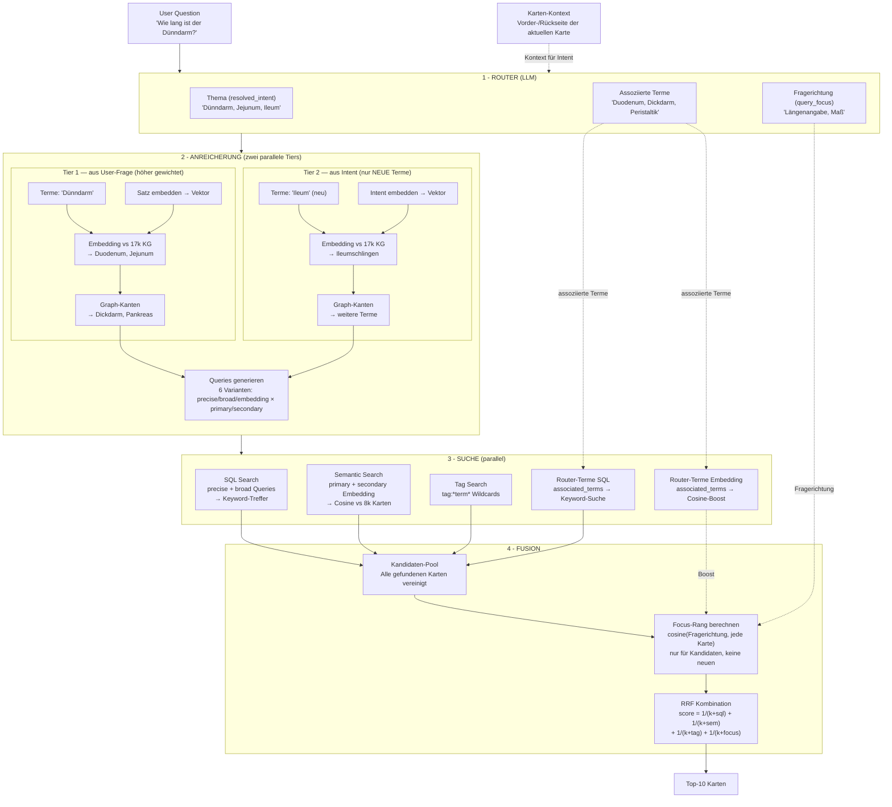

# Retrieval System — Architecture & Evaluation Guide

## Overview

The retrieval system finds relevant flashcards for a user's question. It combines four search strategies into a single ranked result via Reciprocal Rank Fusion (RRF).

**Core principle:** Embedding-first KG expansion, then Graph edges, then parallel SQL + Semantic + Tag search, then mathematical ranking.

## Current Benchmark Results (2026-03-28, v63%)

| Metric | Value | Notes |
|--------|-------|-------|
| **Recall@10** | **63%** | Target card in top-10 results |
| **Context** | **100%** | Was 0% → solved by card_context terms + embedding fallback |
| Direct | 75% | Exact term matches |
| Cross-Deck | 66% | Collection-wide search |
| Typo | 75% | Fuzzy embedding matching |
| Synonym | 6% | First movement via Router associated_terms |
| Top-3 | 36% | Target card in top-3 results |
| MRR | 0.311 | Mean Reciprocal Rank |

**Session progress (2026-03-28):** 46% → 63% Recall@10 through:
1. `resolved_intent` from card_context.terms for context cases (+9%)
2. Embedding fallback: combine query with intent when no domain terms found (+5%)
3. Focus lane: query rerank within candidate pool (k=80) (+1%)
4. Router `associated_terms`: LLM-generated domain terms as SQL + semantic lane (+2%)

**Honest assessment:** SQL keyword search is the strongest signal for direct/context cases. Synonym remains the biggest challenge — the Router generates correct associated terms but they need stronger weighting in the ranking. LLM validation confirmed: 0 false positives in 310 card evaluations.

**Dashboard:** Run `python3 scripts/benchmark_serve.py` and open `http://localhost:8080` for the interactive benchmark dashboard.

## Pipeline Overview



**Leserichtung (oben → unten):**

1. **Router** bekommt Frage + Kartenkontext → gibt drei Dinge zurück: Thema, Fragerichtung, und ob überhaupt gesucht werden muss
2. **Anreicherung** läuft in zwei parallelen Tiers:
   - **Tier 1 (Primary):** Aus deiner Frage — höher gewichtet (k=50-70 in RRF)
   - **Tier 2 (Secondary):** Aus dem Router-Intent — nur NEUE Terme die Tier 1 nicht schon hat, niedriger gewichtet (k=90-120)
   - Jeder Tier durchläuft denselben Prozess: Terme extrahieren → Satz embedden → Embedding vs KG → Graph-Kanten → Queries generieren
   - Am Ende: 6 Query-Varianten (precise/broad/embedding × primary/secondary)
3. **Suche** läuft parallel mit allen 6 Queries: SQL (Keywords), Semantic (Embeddings), Tags
4. **Fusion:** Alle Suchergebnisse → Kandidaten-Pool → Focus-Rang (Fragerichtung) für jede Karte → RRF kombiniert alle Signale

### Alle Queries im Überblick

Am Ende der Anreicherung entstehen 6 Queries + 2 Sucharten. Hier die komplette Übersicht, sortiert nach Suchtyp:

**SQL-Suche (Keyword-basiert, via Anki `find_cards()`)**

| # | Query | Quelle | Logik | Beispiel | RRF k-Wert |
|---|-------|--------|-------|----------|------------|
| 1 | Precise Primary | Tier 1 (Frage) | AND | `"Dünndarm" AND "Duodenum"` | k=50 (stärkste) |
| 2 | Broad Primary | Tier 1 (Frage) | OR | `"Dünndarm" OR "Duodenum" OR "Jejunum"` | k=70 |
| 3 | Precise Secondary | Tier 2 (Intent) | AND | `"Ileum" AND "Ileumschlingen"` | k=90 |
| 4 | Broad Secondary | Tier 2 (Intent) | OR | `"Ileum" OR "Ileumschlingen"` | k=110 |
| 5 | Tag Search | Tier 1 + 2 | Wildcard | `tag:*Dünndarm*`, `tag:*Duodenum*` | k=70 |

**Embedding-Suche (Cosine Similarity vs 8k Karten-Embeddings)**

| # | Query | Quelle | Inhalt | Beispiel | RRF k-Wert |
|---|-------|--------|--------|----------|------------|
| 6 | Semantic Primary | Tier 1 (Frage) | Frage + Expansionsterme | `"wie lang ist der dünndarm Duodenum Jejunum Dickdarm"` | k=60 |
| 7 | Semantic Secondary | Tier 2 (Intent) | Intent + Expansionsterme | `"Dünndarm Jejunum Ileum Ileumschlingen"` | k=120 (schwächste) |

**Router-generierte Terme (associated_terms)**

| # | Signal | Quelle | Berechnung | Beispiel | RRF k-Wert |
|---|--------|--------|------------|----------|------------|
| 8 | Router SQL | Router associated_terms | SQL-Suche nach LLM-generierten Termen | `"Broca-Aphasie"`, `"Sprachverständnis"` | k=70 (broad primary) |
| 9 | Router Embedding | Router associated_terms | cosine(terms_embedding, karte) im Kandidaten-Pool | Alle Router-Terme als ein Embedding | k=75 |

**Focus-Signal (Query Rerank)**

| # | Signal | Quelle | Berechnung | Beispiel | RRF k-Wert |
|---|--------|--------|------------|----------|------------|
| 10 | Focus Rang | Original-Frage | cosine(query_embedding, karte) nur im Kandidaten-Pool | Frage-Embedding vs jede gefundene Karte | k=80 |

**Gewichtungs-Hierarchie** (niedrigerer k = stärkerer Einfluss):

```
k=50  Precise Primary     ████████████████████  stärkste — exakte Terme aus deiner Frage
k=60  Semantic Primary    ██████████████████    Embedding deiner Frage
k=70  Broad/Tag/Router    ████████████████      breitere Suche + Router-Terme
k=75  Router Embedding    ███████████████       Router-Terme als Embedding-Boost
k=80  Focus Rerank        ██████████████        Frage-Richtung im Kandidaten-Pool
k=90  Precise Secondary   ████████████          exakte Terme aus Intent
k=110 Broad Secondary     ██████████            breitere Suche aus Intent
k=120 Semantic Secondary  █████████             schwächste — Embedding des Intents
```

**Warum diese Reihenfolge?** Deine eigenen Worte sind am wertvollsten (Tier 1). Router-Terme ergänzen fehlende Synonyme und verwandte Begriffe. Focus re-rankt den Kandidaten-Pool nach Frage-Relevanz. Was der Intent ergänzt (Tier 2) hilft bei vagen Fragen.

### Pipeline Detail (6 Phases)

```
USER QUESTION: "wie lang ist der dünndarm"
    |
    v
PHASE 1: ROUTER (~250ms, backend LLM)
    Agent routing + context resolution + question focus
    Output: {
      agent: "tutor",
      search_needed: true,
      resolved_intent: "Dünndarm, Jejunum, Ileum, Duodenum",
      query_focus: "Längenangabe, Maß, Gesamtlänge"
    }
    - resolved_intent = THEMA (welche Fachbegriffe sind relevant?)
    - query_focus     = FRAGERICHTUNG (was genau will der User wissen?)
    |
    v
PHASE 2: TERM EXTRACTION + EMBEDDING (~200ms, 1 API call)
    Extract terms: ["Dünndarm"]
    Batch embed: [terms, query, resolved_intent, query_focus]
    -> term vectors (for KG fuzzy matching)
    -> sentence vector (for KG expansion + semantic search)
    -> focus vector (for boost in Phase 6)
    |
    v
PHASE 3: KG ENRICHMENT (~30ms, local)
    A. Sentence-level expansion: sentence vector vs 17k KG term embeddings
       -> finds: Duodenum(0.67), Jejunum(0.66), Ileumschlingen(0.69)
       -> filters morphological variants (Dünndarms, Dünndarmkonvolut)
    B. KG-based stopword filter: "macht", "liegt" NOT in KG -> excluded from SQL
    C. Edge expansion: Dünndarm -> Dickdarm(7), Pankreas(6)
    D. Query generation (deterministic, no LLM):
       Precise: "Dünndarm", "Duodenum", "Jejunum"
       Broad: "Dünndarm" OR "Duodenum" OR "Jejunum" OR ...
       Embedding: "wie lang ist der dünndarm Duodenum Jejunum Ileumschlingen"
    |
    v
PHASE 4: PARALLEL SEARCH
    SQL Search: Anki find_cards() with generated queries
    Semantic Search: cosine similarity against 8k+ card embeddings
    Tag Search: Anki find_cards() with "tag:*term*"
    Feedback Loop: top-5 semantic hits -> extract KG terms -> additional SQL
    |
    v
PHASE 5: RRF FUSION + FOCUS
    1. Collect all cards found by SQL, Semantic, and Tag searches → candidate pool
    2. For each candidate: compute focus_rank from cosine(focus_vector, card_embedding)
    3. Combine ALL signals via Reciprocal Rank Fusion:

       score(card) = 1/(k + sql_rank) + 1/(k + sem_rank) + 1/(k + focus_rank)

    k-values by tier (lower k = more weight):
      Precise Primary:    k=50
      Semantic Primary:   k=60
      Focus:              k=55   (NEW — between Precise and Semantic)
      Broad Primary:      k=70
      Precise Secondary:  k=90
      Broad Secondary:    k=110
      Semantic Secondary: k=120

    KEY PRINCIPLE: Focus is a signal IN the fusion, not a post-processing step.
    - Card matching SQL + Semantic + Focus → 3 contributions → highest score
    - Card matching SQL + Semantic, low Focus → 2 strong + 1 weak → good score
    - Card matching SQL only, low Focus → 1 contribution → low score
    - Card not found by any search → not in candidate pool → Focus irrelevant
    |
    v
CONFIDENCE CHECK
    high (>threshold) → answer from cards
    low (<threshold)  → trigger web search
```

## Key Files

| File | Responsibility |
|------|---------------|
| `ai/kg_enrichment.py` | Term extraction, KG expansion (embedding + edges), query generation |
| `ai/rrf.py` | Reciprocal Rank Fusion scoring, confidence check |
| `ai/retrieval.py` | `EnrichedRetrieval` class — orchestrates the full pipeline |
| `ai/rag_pipeline.py` | Entry point: `retrieve_rag_context()`, routes to EnrichedRetrieval |
| `ai/rag.py` | SQL search: `rag_retrieve_cards()` (Anki find_cards wrapper) |
| `ai/embeddings.py` | Embedding API, in-memory card index, KG term index, fuzzy search |
| `ai/router.py` | Agent routing (tutor/research/help/plusi), resolved_intent |
| `ai/tutor.py` | Tutor agent — calls pipeline, handles generation + fallback |
| `storage/kg_store.py` | KG persistence: terms, edges, definitions, embeddings, card content cache |
| `ai/kg_builder.py` | Builds KG graph (edges, frequencies, term embeddings) |
| `functions/src/handlers/router.ts` | Backend router — agent + search_needed + resolved_intent |

## Search Strategies

### 1. SQL Keyword Search (via Anki find_cards)

Searches card text using Anki's built-in full-text search. Queries are generated deterministically from KG enrichment (no LLM involved). Tiered cascade: precise AND queries first, then broad OR queries if results are sparse.

### 2. Semantic Search (Embedding Cosine Similarity)

Embeds the user question and compares against 8k+ pre-computed card embeddings. Primary driver of recall. Uses dual vectors: primary (user's question) and secondary (resolved_intent from router).

### 3. Tag-Based Search

New in v2.1. Searches Anki's hierarchical tag system using `tag:*term*` wildcards. Tags like `Anatomie::GI-Trakt::Duenndarm` are matched when KG enrichment finds terms that appear in the tag hierarchy. Adds cards that keyword search might miss because the term appears in tags but not in card text.

### 4. Semantic-Informed SQL Expansion (Feedback Loop)

Extracts KG terms from the top-5 semantic search results, then runs additional SQL queries with those terms. Finds cards that semantic search "knows about" but SQL missed.

## KG Enrichment Strategy

### Universal Stopword Filtering

No hardcoded stopword lists per language. Instead:

```
Term in KG? -> Domain term -> use for SQL + Embedding queries
Term NOT in KG? -> Generic word -> use for Embedding only (not SQL)
```

The KG contains only terms extracted from the user's cards. "Dünndarm", "ATP", "Plexus brachialis" are in the KG. "macht", "liegt", "produziert" are not. This works for ANY language.

### Term Expansion (Embedding-first, then Edges)

```
1. Sentence embedding vs KG term embeddings -> semantic synonyms
   (Dünndarm question finds Duodenum, Jejunum)
2. Edge expansion on ALL found terms -> co-occurrence terms
   (Dünndarm -> Dickdarm, Pankreas; Duodenum -> Jejunum)
3. Morphological variant filter removes noise
   (Dünndarms, Dünndarmkonvolut filtered out)
```

### Multi-Word Term Detection

Latin compound prefixes (Plexus, Nervus, Arteria, etc.) trigger multi-word extraction:
- "Plexus brachialis" -> one term (not "Plexus" + "brachialis")
- Consecutive capitalized words: "Braunes Fettgewebe" -> one term

### Query Priority

Precise SQL queries are ordered by relevance:
1. Original terms (user's own words)
2. Edge-expanded terms from originals (high co-occurrence = high card relevance)
3. Sentence-embedding expansion terms (new vocabulary)
4. Edge-expanded terms from embedding-found terms

Max 5 precise queries to reduce noise.

## Backend Router (resolved_intent)

The backend router (`functions/src/handlers/router.ts`) now returns only 3 fields:

```json
{
  "agent": "tutor",
  "search_needed": true,
  "resolved_intent": "clear description of what the user wants to know"
}
```

**Status:** Deployed. The old query generation fields (precise_queries, broad_queries, embedding_queries, retrieval_mode, search_scope, max_sources, response_length) are removed from the router prompt. Query generation is now handled entirely by local KG enrichment, which is deterministic and does not require an LLM call.

**resolved_intent** is critical for context-dependent questions. When a user asks "explain that" while looking at a card about the small intestine, the router resolves this to a specific intent like "detailed explanation of the structure and segments of the small intestine (duodenum, jejunum, ileum)". This resolved intent feeds into KG enrichment as secondary tier terms.

## RRF Scoring

Reciprocal Rank Fusion (Cormack et al., 2009) combines ranked lists without requiring score normalization:

```python
score(card) = sum(1 / (k + rank_i)) for each search that found the card
```

Lower k = more weight. Cards found by multiple searches get a natural multi-source boost.

Constants in `ai/rrf.py`:
- `K_PRECISE_PRIMARY = 50` (AND queries from user's terms)
- `K_SEMANTIC_PRIMARY = 60` (embedding search from user's query)
- `K_BROAD_PRIMARY = 70` (OR queries from user's terms)
- `K_PRECISE_SECONDARY = 90` (queries from Router intent)
- `K_BROAD_SECONDARY = 110`
- `K_SEMANTIC_SECONDARY = 120`

Confidence thresholds (tunable):
- `CONFIDENCE_HIGH = 0.025` (answer from cards)
- `CONFIDENCE_LOW = 0.012` (trigger Perplexity web search)

## Card Content Cache

Cards' question/answer text is cached in `card_content` table (in `card_sessions.db`) during background embedding. This enables:
- Offline text search via `search_card_content(query)` in `storage/kg_store.py`
- Benchmark card export via `python3 scripts/benchmark_cache_cards.py`

The cache is populated automatically when Anki runs the `BackgroundEmbeddingThread`.

## Evaluation

### Benchmark Dashboard

```bash
python3 scripts/benchmark_serve.py
# Open http://localhost:8080
```

The dashboard shows:
- Overall Recall@10 and Top-3 metrics
- Per-step scores (term extraction, KG expansion, SQL, semantic, RRF, confidence)
- Per-category breakdown (direct, synonym, context, cross-deck, typo)
- Expandable trace for each test case
- System documentation (this file) with rendered markdown

### CLI Eval Script

Test the enrichment pipeline without running Anki:

```bash
# Single query
python3 scripts/eval_retrieval.py "wie lang ist der dünndarm"

# All built-in test queries
python3 scripts/eval_retrieval.py --all
```

Output shows every pipeline step:
1. Term Extraction (which terms were extracted)
2. Embedding (API call timing)
3. Sentence-Level KG Expansion (which KG terms matched, with scores)
4. Term-Level KG Expansion (morphological matches)
5. Graph Edge Expansion (co-occurrence terms with weights)
6. Full enrich_query() result (final queries, tier breakdown)

### Test Suite

```bash
python3 run_tests.py -k test_rrf -v          # RRF scoring tests (10 tests)
python3 run_tests.py -k test_kg_enrichment -v  # KG enrichment tests (11 tests)
python3 run_tests.py -k test_kg_store -v       # KG storage tests
python3 run_tests.py -k test_kg_builder -v     # KG builder tests
```

### Test Queries for Manual Evaluation

| Query | Expected Key Terms |
|---|---|
| "wie lang ist der dünndarm" | Dünndarm, Jejunum, Ileum, Duodenum |
| "was macht ATP in der Zelle" | ATP, ADP, AMP, Glykolyse, Phosphorylierung, Atmungskette |
| "wo liegt der Plexus brachialis" | Plexus brachialis, C5-T1, Armnerven |
| "welche Hormone produziert die Schilddrüse" | Hormone, Schilddrüse, T3, T4, Calcitonin |
| "Bauernfettgewebe" (typo) | braunes Fettgewebe, UCP1, Thermogenese |
| "wie funktioniert die Nernst-Gleichung" | Nernst-Gleichung, Membranpotential |
| "welche Hirnnerven gibt es" | Hirnnerven, Hirnstamm, Ganglien |

## Known Limitations & Next Steps

### Current Limitations

1. **KG-Term-Embeddings sind als Einzelwörter embedded** — "Jejunum" als nacktes Wort ist lexikalisch weit von "Dünndarm". Sentence-Embedding der Frage findet es (Score 0.66), aber viele Darm*-Varianten scoren höher.

2. **Nur 28 von 17.335 Termen haben Definitionen** — Terme mit Definition werden besser embedded ("Jejunum: mittlerer Abschnitt des Dünndarms"), aber fast alle Terme haben noch keine.

3. **Embedding-API-Latenz** — ~200ms pro Batch-Call. Nicht schlimm, aber addiert sich.

4. **Confidence-Schwellenwerte sind Schätzungen** — müssen mit echten Daten kalibriert werden.

5. **Tag-based search ist neu und nicht benchmarked** — erste Implementation nutzt Wildcard-Matching, Effektivität noch unklar.

### High-Impact Next Steps

1. **Mehr KG-Definitionen generieren** — Jeder Term mit Definition bekommt ein semantisch reicheres Embedding. Target: 1000+ Definitionen.

2. **Term-Embeddings re-berechnen** mit Definitionen — einmalig nach Definition-Generierung.

3. **Confidence-Thresholds kalibrieren** — RRF-Scores loggen + User-Feedback korrelieren.

4. **Tag-Search benchmarken** — Recall-Impact der Tag-basierten Suche messen.

5. **Card Content Cache für Benchmark nutzen** — Realistischere SQL-Simulation im Offline-Benchmark.

## Changelog

### v2.1 (2026-03-27)
- **Backend Router simplified:** Now returns only 3 fields (agent, search_needed, resolved_intent). Query generation moved entirely to local KG enrichment.
- **Tag-based search added:** Searches Anki hierarchical tags via `tag:*term*` wildcards using KG-enriched terms.
- **Card content cache:** `card_content` table in card_sessions.db, populated during background embedding. Enables offline text search and benchmark export.
- **Benchmark dashboard:** Docs tab now renders proper markdown instead of raw preformatted text.
- **Semantic-informed SQL expansion:** Feedback loop extracts KG terms from top semantic hits for additional SQL queries.

### v2.0 (2026-03-27)
- KG-enriched query expansion, RRF scoring, embedding-first expansion, universal KG stopword filter.
- Spec: `docs/superpowers/specs/2026-03-27-retrieval-algorithm-redesign.md`

### v1.0 (pre-2026-03-27)
- LLM Router generates queries, KG as dead-arm parallel search, source-count merge.
